In the top left of of the unreal engine interface you will find the Map Name. 

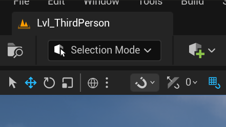

Below that is the Viewport, where you can see and interact with your level.

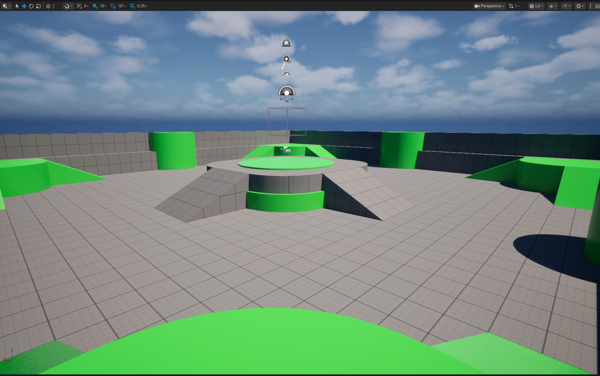

To the right you have the outliner, which shows all the actors in your level.

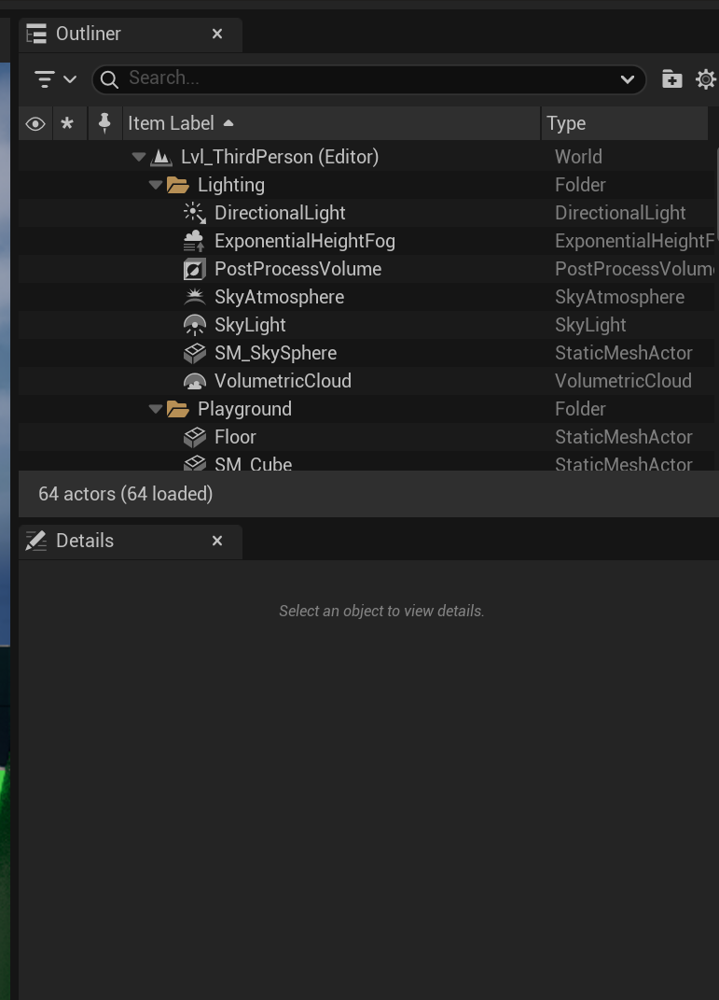

All objects in unreal are known as actors.

The right mouse button allows you to look around in the viewport, and wasd while holding the right mouse allows you to move around in the level.
Q and E while holding the right mouse move up and down in the level.

The Run button allows you to play the level and test your game within the editor.

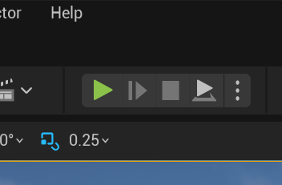

On the small bar above the viewport on the right side there is the camera speed, which can be changed by holding the right mouse button and using the mouse scroll wheel.

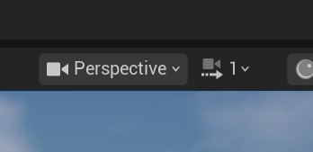

If you need to ruturn to a specific actor in the outliner, you can double-click on it, and the viewport will focus on that actor.
This is useful for quickly locating and editing specific actors in your level or resetting the camera view to a known position.

Below the level name is the toolbar, notably the quick add button, which allows you to quickly add common actors to your level such as lights, cameras, and basic geometry.

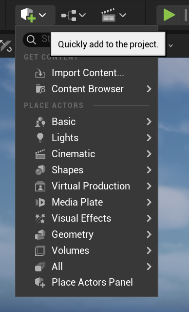 

After adding a cube we are able to slect it and drag it into our level within the viewport.
You can also use the transform gizmo to move, rotate, and scale the selected actor.

To move on the xyz axis you must be in the move mode of the transform gizmo, which is represented by the arrows pointing in the x, y, and z directions.

In the details pane with an actor selected, you can view and edit the properties of that actor, such as its location, rotation, scale, and other specific settings depending on the type of actor.

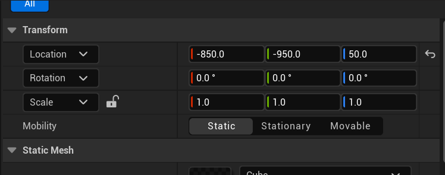

There is also a rotate mode, represented by circular handles around the selected actor.

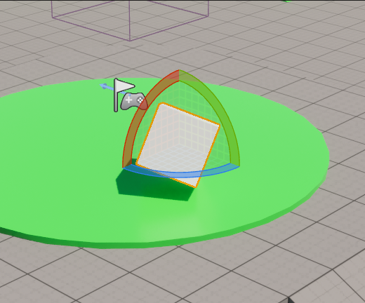

and a scale mode, represented by cubes at the ends of the arrows.

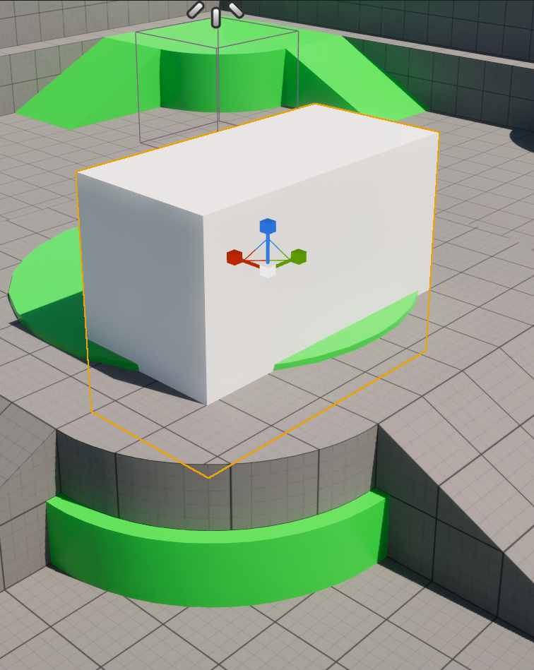

Within the scale mode there are three squares, these allow you to manipulate the scale of the actor on two axis simultaneously.

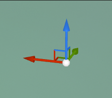

There is also an option near the transform toolbar area to set the unit of measurement for the transform gizmo, allowing you to work with precise increments for moving, rotating, and scaling actors.

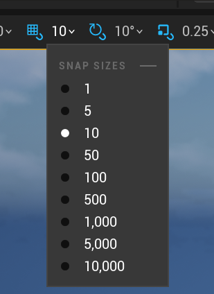